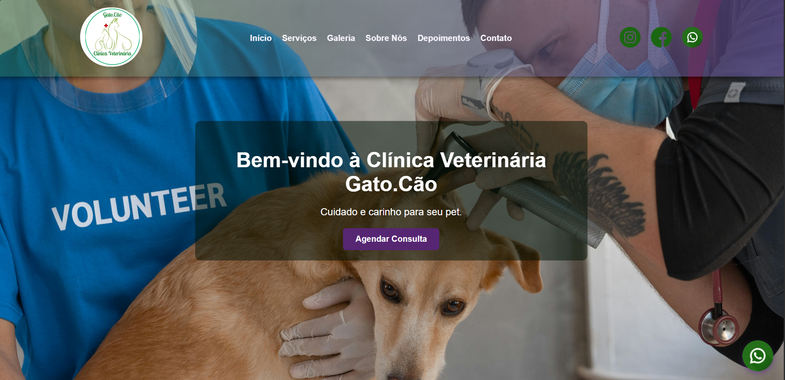

# 🐾 Site da Clínica Veterinária Gato&Cão

Este é um site moderno, responsivo e interativo desenvolvido para a clínica veterinária **Gato&Cão**, com o objetivo de melhorar a presença online da clínica e proporcionar uma melhor experiência ao cliente.

## 🚀 Tecnologias Utilizadas

- HTML5
- CSS3 (com responsividade via Media Queries)
- JavaScript (interatividade e efeitos)
- PHP (envio de formulário por e-mail)
- Google Maps (localização)
- GitHub Pages (opcional para publicação)

---

## 💡 Funcionalidades

✔️ **Slider com imagem/vídeo e texto sobreposto**  
✔️ **Menu responsivo com botão hambúrguer para mobile**  
✔️ **Botão flutuante do WhatsApp para contato rápido**  
✔️ **Seção "Sobre a Clínica" com foto da fundadora**  
✔️ **Missão, Visão e Valores destacados**  
✔️ **Seção de Serviços com ícones e descrições**  
✔️ **Galeria de imagens com título e hover transparente para descrição**  
✔️ **Seção de Depoimentos com layout semelhante à galeria**  
✔️ **Formulário de Contato funcional com envio via PHP e mapa ao lado**  
✔️ **Design 100% Responsivo para todas as telas**  
✔️ **SEO básico com meta tags**  
✔️ **Acessibilidade seguindo boas práticas de desenvolvimento**

---

## 📸 Imagem do Projeto 

> 

---

## ✉️ Contato

Desenvolvido por **Sarah Rayssa**  
📧 Email: [sarahrayssaalvesdasilva@gmail.com]  

---

## 📌 Publicação

> O site pode ser acessado online via GitHub Pages:  
> 🔗 (https://sarahrayssa.github.io/Site-GatoCao/)

---

## 📝 Licença

Este projeto é de uso exclusivo para apresentação à clínica **Gato&Cão**.  
Não é permitida a reprodução ou cópia sem autorização do desenvolvedor.

